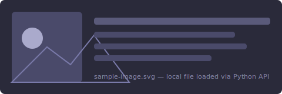
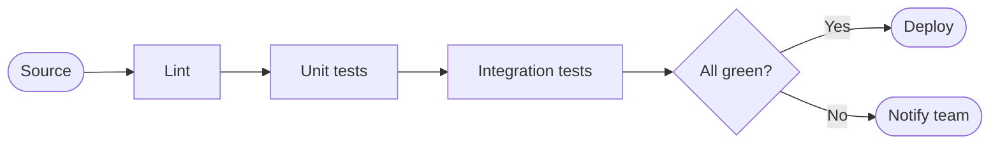
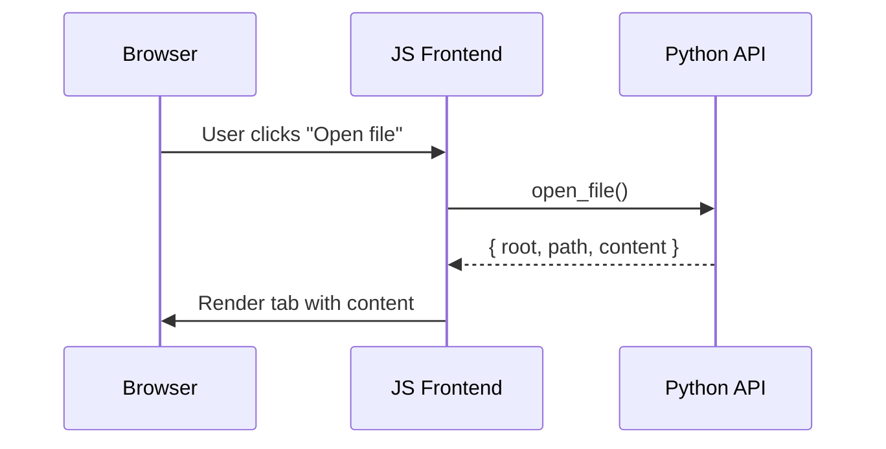
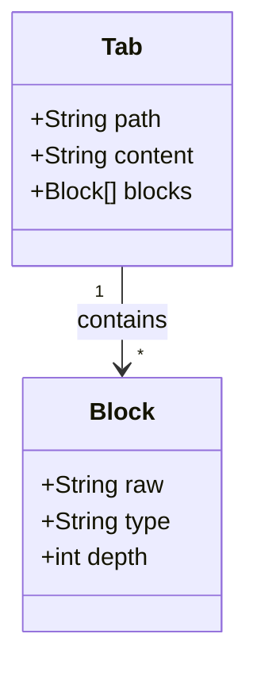
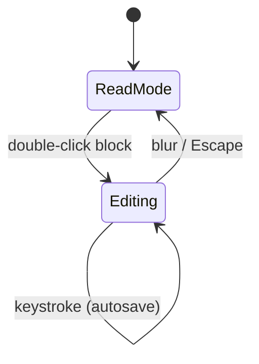
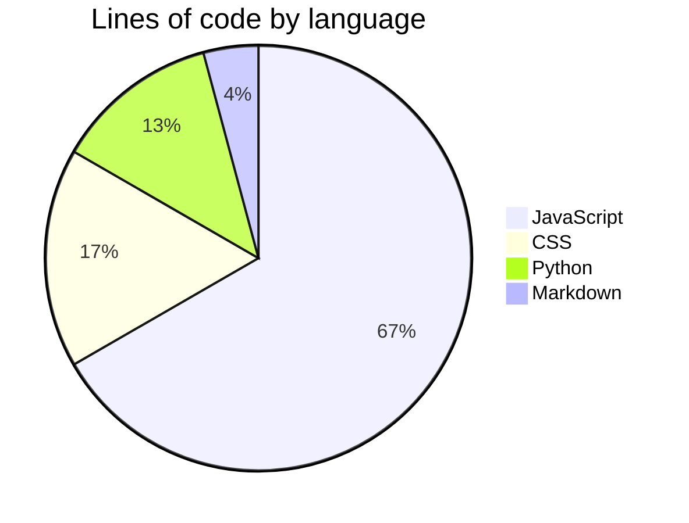

# Markdown Sampler

A reference file that exercises every major Markdown feature supported by Inkwave.

---

## Headings

# Heading 1

## Heading 2

### Heading 3 ssdfgs

#### Heading 4

##### Heading 5

###### Heading 6

---

## Paragraphs & Line Breaks

This is a paragraph. Lorem ipsum dolor sit amet, consectetur adipiscing elit.
Sentences on adjacent lines are joined into one paragraph.

A blank line starts a new paragraph. Pellentesque habitant morbi tristique
senectus et netus et malesuada fames ac turpis egestas.

---

## Emphasis

**Bold text** and __also bold__.

*Italic text* and _also italic_.

***Bold and italic*** and ___also bold and italic___.

~~Strikethrough text~~.

---

## Blockquotes

> A simple blockquote.

> Nested blockquotes are supported too.
>
> > This is a second level of nesting.
>
> Back to the first level.

---

## Lists

### Unordered

- Apples
- Oranges
- Strawberries

```ruby  
def foobar:
  return "baz" 
```

- Bananas
  - Cavendish
  - Plantain

### Ordered

1. First item
2. Second item
3. Third item

### Task list

- [x] Write the sampler file
- [x] Add a mermaid diagram
- [ ] Review the output
- [ ] Ship it

---

## Code

Inline code: use `console.log("hello")` to print to the console.

A fenced code block with syntax highlighting:

```javascript
function fibonacci(n) {
  if (n <= 1) return n;
  return fibonacci(n - 1) + fibonacci(n - 2);
}

console.log(fibonacci(10)); // 55
```

A Python example:

```python
def greet(name: str) -> str:
    return f"Hello, {name}!"

print(greet("Inkwave"))
```

A shell snippet:

```bash
#!/usr/bin/env bash
set -euo pipefail

echo "Running tests…"
npx vitest run --coverage
python3 -m pytest tests/python/ -v
```

---

## Horizontal Rules

Three or more dashes, asterisks, or underscores produce a rule:

---

***

___

---

## Links & Images

[Inkwave on GitHub](https://github.com/ssstonebraker/inkwave)

[Link with a title](https://example.com "Example Domain")

A bare URL: <https://example.com>

An image (falls back gracefully if the path is missing):



---

## Tables

| Language   | Paradigm        | Typing   |
|------------|-----------------|----------|
| Python     | Multi-paradigm  | Dynamic  |
| TypeScript | OOP / FP        | Static   |
| Haskell    | Functional      | Static   |
| Ruby       | OOP             | Dynamic  |

Alignment in columns:

| Left-aligned | Centre-aligned | Right-aligned |
|:-------------|:--------------:|--------------:|
| Apple        |    Orange      |        Banana |
| 1            |       2        |             3 |

---

## Footnotes

Inkwave supports footnotes via a custom rendering pass.[^1]
You can have multiple references[^note] in a single document.

[^1]: This is the first footnote definition.
[^note]: Footnotes can use short labels too.

---

## Inline HTML

Markdown renderers typically pass through safe inline HTML:

<kbd>Cmd</kbd> + <kbd>C</kbd> to copy.

<details>
<summary>Click to expand a hidden section</summary>

This content is hidden until the summary is clicked.

</details>

---

## Mermaid Diagrams

### Flowchart — build pipeline



### Sequence diagram — API request lifecycle



### Class diagram — block model



### State diagram — inline editor lifecycle



### Pie chart — language breakdown



---

## Escaping

Backslash escapes special characters: \*not italic\*, \`not code\`, \[not a link\].

---

*End of sampler.*